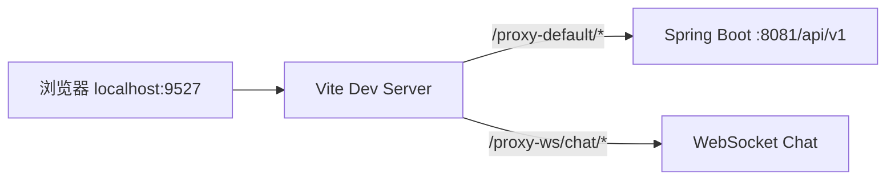

# 学习摘要

PaiSmart 是一个**企业级 AI 知识库 + RAG 问答**系统：用户上传文档 → 后端切片、向量化、存入 Elasticsearch → 聊天时检索相关片段 → 调用大模型生成带引用的回答。

你当前在 `frontend` 目录，但学习时建议**前后端一起看**，因为核心业务是跨端的。

---


## 一、技术栈一览

| 层级 | 技术 |
|------|------|
| 前端 | Vue 3 + TypeScript + Vite + Pinia + Naive UI + UnoCSS |
| 脚手架 | 基于 [SoybeanAdmin](https://github.com/soybeanjs/soybean-admin) 改造 |
| 路由 | elegant-router（文件即路由，自动生成） |
| 后端 | Spring Boot + JPA + Spring Security + JWT |
| 存储 | MySQL（持久化）、Redis（会话/缓存）、MinIO（文件）、Elasticsearch（检索） |
| 消息队列 | Kafka（异步文档处理） |
| AI | DeepSeek 等 LLM + Embedding 向量化 |

本地开发地址：

- 前端：`http://localhost:9527`
- 后端 API：`http://localhost:8081/api/v1`
- 浏览器里请求会走 Vite 代理，形如 `/proxy-default/...`

---

## 二、项目整体结构

```
PaiSmart/
├── frontend/          ← 你当前所在（Vue 3 前端）
├── src/main/java/     ← Spring Boot 后端
├── docs/              ← Docker Compose 一键启动中间件
├── AGENTS.md          ← 本地开发约定（必读）
└── CLAUDE.md          ← 架构说明
```

### 前端目录（`frontend/src/`）

```
src/
├── main.ts              # 应用入口
├── App.vue
├── router/              # 路由 + 守卫（登录/权限）
├── store/modules/       # Pinia 状态（auth、chat、knowledge-base…）
├── service/
│   ├── api/             # REST API 封装
│   └── request/         # Axios 封装（token 刷新、错误处理）
├── views/               # 页面组件（按功能分）
├── layouts/             # 布局（侧边栏、顶栏、标签页）
├── components/          # 通用组件
├── hooks/               # 组合式函数
├── constants/           # 常量
└── typings/api.d.ts     # API 类型定义
```

### 后端目录（`src/main/java/com/yizhaoqi/smartpai/`）

```
controller/    # REST API 入口
service/       # 业务逻辑（ChatHandler、ElasticsearchService…）
repository/    # 数据访问
entity/        # JPA 实体
handler/       # WebSocket 处理
consumer/      # Kafka 消费者（文档异步处理）
config/        # 安全、JWT 等配置
```

---

## 三、功能模块与页面对应

路由定义在 `src/router/elegant/routes.ts`：

| 页面 | 路径 | 角色 | 作用 |
|------|------|------|------|
| 智能对话 | `/chat` | 所有用户 | 核心 RAG 聊天 |
| 知识库 | `/knowledge-base` | 所有用户 | 文档上传、管理、预览 |
| 组织标签 | `/org-tag` | ADMIN | 多租户组织管理 |
| 模型配置 | `/model-provider` | ADMIN | LLM 提供商配置 |
| 用户管理 | `/user` | ADMIN | 用户、配额、组织 |
| 邀请码 | `/invite-code` | ADMIN | 注册邀请 |
| 对话历史 | `/chat-history` | ADMIN | 全站对话审计 |
| 用量监控 | `/usage-monitor` | ADMIN | Token 使用统计 |
| 充值 | `/recharge` | 所有用户 | 用户充值 |
| 充值管理 | `/recharge-manage` | ADMIN | 充值审核 |
| 个人中心 | `/personal-center` | 所有用户 | 个人信息 |

---

## 四、核心业务流程（建议按这个顺序学）

### 1. 启动与请求链路



入口：`main.ts` → 初始化 Store、Router、i18n → 挂载 `App.vue`。

HTTP 请求统一走 `src/service/request/index.ts`：

- 自动带 JWT `Authorization`
- Token 过期自动刷新
- 后端成功码为 `0000`（见 `.env` 配置）

### 2. 认证与权限

**学习路径：**

1. `views/_builtin/login/` — 登录/注册 UI
2. `service/api/auth.ts` — 登录/注册 API
3. `store/modules/auth/index.ts` — Token、用户信息、登出
4. `router/guard/route.ts` — 路由守卫（未登录跳转、ADMIN 权限）

权限模型很简单：

- `USER`：普通用户
- `ADMIN`：管理员（路由 `meta.roles: ['ADMIN']` 控制）

### 3. 知识库（文档上传）— 第二重要

**学习路径：**

1. `views/knowledge-base/index.vue` — 文档列表页
2. `store/modules/knowledge-base/index.ts` — **分片上传**逻辑（MD5、并发分片）
3. 后端 `UploadController` → Kafka → 解析 → 向量化 → ES 索引

前端上传特点：

- 大文件按 chunk 切分（`chunkSize`）
- 每文件最多 4 个并发分片
- 支持断点续传（记录已上传 chunk）

### 4. 智能对话（RAG）— 最核心

**学习路径：**

1. `views/chat/index.vue` — 聊天页布局
2. `views/chat/modules/` — 消息列表、输入框、会话侧边栏、引用预览
3. `store/modules/chat/index.ts` — **核心状态机**（约 400+ 行）

聊天双通道：

| 通道 | 用途 |
|------|------|
| REST | 会话列表、历史消息、生成状态快照 |
| WebSocket | 实时流式回答、`/proxy-ws/chat/{token}` |

后端 `ChatHandler.java` 负责：

1. 接收用户问题（WebSocket）
2. `HybridSearchService` 混合检索 Elasticsearch
3. `LlmProviderRouter` 调用大模型流式生成
4. 生成 `referenceMappings`（回答中的引用编号 → 文档片段）
5. `ConversationService` 持久化到 MySQL；Redis 存短期上下文

前端 `chat store` 要点：

- `loadSessions()` / `switchSession()` — 多会话
- `useWebSocket` — 流式消息、心跳、断线重连
- `upsertGenerationSnapshot()` — 同步生成状态与引用

### 5. 多租户

- 组织标签：`org-tag` 页面 + `OrgTag` 实体
- 文档可按 `orgTag` 隔离，支持公开/私有
- 用户可绑定多个组织（`userInfo.orgTags`）

---

## 五、推荐学习路线（由浅入深）

### 第 1 天：跑起来 + 熟悉骨架

```bash
# 中间件（MySQL、Redis、ES、Kafka、MinIO）
cd docs && docker-compose up -d

# 后端（IDE 或命令行）
mvn spring-boot:run

# 前端
cd frontend && pnpm install && pnpm dev
```

然后浏览：

1. 登录 → `/chat` → `/knowledge-base`
2. 打开 DevTools → Network，看 `/proxy-default/` 请求
3. 读 `AGENTS.md`、`CLAUDE.md`

### 第 2 天：前端架构

按顺序读：

1. `main.ts`
2. `router/index.ts` + `router/guard/route.ts`
3. `store/modules/auth/index.ts`
4. `service/request/index.ts`
5. `typings/api.d.ts`（所有 API 类型）

### 第 3 天：聊天功能（前端）

1. `views/chat/index.vue`
2. `store/modules/chat/index.ts`（重点）
3. `views/chat/modules/chat-message.vue`（Markdown 渲染、引用）
4. `views/chat/modules/reference-preview-page.vue`（引用预览）

### 第 4 天：知识库（前端）

1. `views/knowledge-base/index.vue`
2. `store/modules/knowledge-base/index.ts`
3. `views/knowledge-base/modules/upload-dialog.vue`

### 第 5 天：后端核心

1. `AuthController` / `UserController`
2. `UploadController` + Kafka consumer
3. `ChatHandler.java`（RAG 主流程）
4. `ElasticsearchService` / `VectorizationService`
5. `ConversationController` / `ConversationSessionController`

### 第 6 天：管理功能

- `views/user/`、`views/org-tag/`、`views/model-provider/`
- 后端 `AdminController`

---

## 六、关键代码入口（收藏用）

| 关注点 | 文件 |
|--------|------|
| 应用启动 | `frontend/src/main.ts` |
| 路由表 | `frontend/src/router/elegant/routes.ts` |
| 登录态 | `frontend/src/store/modules/auth/index.ts` |
| HTTP 封装 | `frontend/src/service/request/index.ts` |
| 聊天状态 | `frontend/src/store/modules/chat/index.ts` |
| 文档上传 | `frontend/src/store/modules/knowledge-base/index.ts` |
| API 类型 | `frontend/src/typings/api.d.ts` |
| RAG 后端 | `src/.../service/ChatHandler.java` |
| 文档检索 | `src/.../service/ElasticsearchService.java` |

---

## 七、调试技巧

1. **聊天没响应**：看 WebSocket 是否连上（Network → WS），以及 `chat store` 里 `wsStatus`
2. **接口 401/403**：看 `Authorization` 和 token 刷新逻辑
3. **历史为空**：历史在 MySQL，不在 Redis；查 `users/conversation` 接口和数据库
4. **引用不显示**：检查 `referenceMappings` 是否从 WebSocket/快照接口带回并在 `chat-message.vue` 渲染
5. **改 Java 后**：优先 `mvn -q -DskipTests compile` 触发热部署，不要默认重启后端

---

## 八、和 SoybeanAdmin 的关系

前端基于 SoybeanAdmin，因此会有：

- `@sa/axios`、`@sa/hooks` 等 workspace 包
- elegant-router 文件路由
- 主题/布局/多标签页等后台管理能力

业务代码主要在 `views/`、`store/modules/chat`、`store/modules/knowledge-base`，脚手架能力在 `layouts/`、`plugins/`。

---

## 九、延伸阅读方向

如需深入某一块，可按以下主题逐文件精读：

- **从发消息到出回答的完整代码路径**（前端 WebSocket + 后端 ChatHandler）
- **文档上传后端怎么处理**（UploadController → Kafka → 向量化 → ES）
- **权限和多租户怎么实现的**（路由守卫 + orgTag 过滤）
- **如何新增一个管理页面**（elegant-router + API + store）


# 学习记录
## main.ts的执行时机
### 1. 浏览器何时触发

入口在 `index.html` 最后一行：

<script type="module" src="/src/main.ts"></script>

典型时间线：

用户访问页面（如 http://localhost:9527）

↓

浏览器请求并解析 index.html

↓

解析到 <div id="app"></div>（此时还是空的）

↓

遇到 type="module" 的 script → 下载 /src/main.ts

↓

HTML 解析完成后执行该模块（module script 默认 defer）

↓

main.ts 及其 import 依赖全部执行完毕

↓

setupApp() 被调用 → 最后 app.mount('#app')

要点：

- 不是 Node/Vite 启动时执行，而是用户打开页面、浏览器加载 HTML 之后才执行。
- `type="module"` 会等 HTML 解析完再跑，不会阻塞前面的 DOM 解析。
- 开发环境由 Vite 实时编译 `main.ts`；生产环境执行的是打包后的 JS，但时机一样——都是页面加载时。

---

### 2. `main.ts` 内部的执行顺序

模块加载后会先跑完所有顶层 import（及其依赖树），再执行本文件剩余代码：

1. import 副作用

├── vue-markdown-shiki/style

├── ./plugins/assets → 注册 SVG、加载 uno.css、global.css

└── 其他 import 只做模块绑定，不立刻执行 setup 函数

2. 执行 setupApp()（文件最后一行）

3. setupApp 内部顺序：

setupLoading() ← 立刻往 #app 写入 Loading 占位

setupNProgress()

setupIconifyOffline()

setupDayjs()

createApp(App)

setupStore(app)

await setupRouter(app) ← 等路由就绪

setupI18n(app)

setupAppVersionNotification()

app.use(markdownPlugin)

app.mount('#app') ← Vue 真正挂载，替换 Loading

所以用户感知上是：

1. 先看到 Loading 页（`setupLoading` 在 `mount` 之前执行）
2. 路由、Store、i18n 就绪后
3. 再渲染真正的 `App.vue`

---

### 3. 和 Vite 开发服务器的关系

|事件|是否执行 main.ts|
|---|---|
|`pnpm dev` 启动 Vite|否，只是起服务|
|浏览器第一次/刷新打开页面|是|
|热更新（HMR）改某个 `.vue`|一般只更新该模块，不会从头重跑整个 `main.ts`|
|刷新页面（F5）|是，完整重跑|

---

### 4. 一句话总结

`main.ts` 在每次页面加载（或刷新）时，由浏览器解析完 `index.html` 后、通过 ES Module 入口执行一次；`setupApp()` 在模块加载后立即调用，在 `app.mount('#app')` 之前完成 Loading、路由、状态、国际化等初始化。
