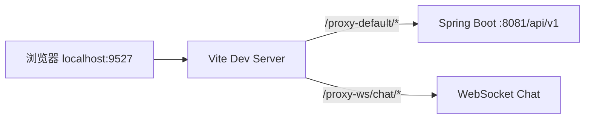

# 学习摘要

PaiSmart 是一个**企业级 AI 知识库 + RAG 问答**系统：用户上传文档 → 后端切片、向量化、存入 Elasticsearch → 聊天时检索相关片段 → 调用大模型生成带引用的回答。

你当前在 `frontend` 目录，但学习时建议**前后端一起看**，因为核心业务是跨端的。

---


## 一、技术栈一览

| 层级 | 技术 |
|------|------|
| 前端 | Vue 3 + TypeScript + Vite + Pinia + Naive UI + UnoCSS |
| 脚手架 | 基于 [SoybeanAdmin](https://github.com/soybeanjs/soybean-admin) 改造 |
| 路由 | elegant-router（文件即路由，自动生成） |
| 后端 | Spring Boot + JPA + Spring Security + JWT |
| 存储 | MySQL（持久化）、Redis（会话/缓存）、MinIO（文件）、Elasticsearch（检索） |
| 消息队列 | Kafka（异步文档处理） |
| AI | DeepSeek 等 LLM + Embedding 向量化 |

本地开发地址：

- 前端：`http://localhost:9527`
- 后端 API：`http://localhost:8081/api/v1`
- 浏览器里请求会走 Vite 代理，形如 `/proxy-default/...`

---

## 二、项目整体结构

```
PaiSmart/
├── frontend/          ← 你当前所在（Vue 3 前端）
├── src/main/java/     ← Spring Boot 后端
├── docs/              ← Docker Compose 一键启动中间件
├── AGENTS.md          ← 本地开发约定（必读）
└── CLAUDE.md          ← 架构说明
```

### 前端目录（`frontend/src/`）

```
src/
├── main.ts              # 应用入口
├── App.vue
├── router/              # 路由 + 守卫（登录/权限）
├── store/modules/       # Pinia 状态（auth、chat、knowledge-base…）
├── service/
│   ├── api/             # REST API 封装
│   └── request/         # Axios 封装（token 刷新、错误处理）
├── views/               # 页面组件（按功能分）
├── layouts/             # 布局（侧边栏、顶栏、标签页）
├── components/          # 通用组件
├── hooks/               # 组合式函数
├── constants/           # 常量
└── typings/api.d.ts     # API 类型定义
```

### 后端目录（`src/main/java/com/yizhaoqi/smartpai/`）

```
controller/    # REST API 入口
service/       # 业务逻辑（ChatHandler、ElasticsearchService…）
repository/    # 数据访问
entity/        # JPA 实体
handler/       # WebSocket 处理
consumer/      # Kafka 消费者（文档异步处理）
config/        # 安全、JWT 等配置
```

---

## 三、功能模块与页面对应

路由定义在 `src/router/elegant/routes.ts`：

| 页面 | 路径 | 角色 | 作用 |
|------|------|------|------|
| 智能对话 | `/chat` | 所有用户 | 核心 RAG 聊天 |
| 知识库 | `/knowledge-base` | 所有用户 | 文档上传、管理、预览 |
| 组织标签 | `/org-tag` | ADMIN | 多租户组织管理 |
| 模型配置 | `/model-provider` | ADMIN | LLM 提供商配置 |
| 用户管理 | `/user` | ADMIN | 用户、配额、组织 |
| 邀请码 | `/invite-code` | ADMIN | 注册邀请 |
| 对话历史 | `/chat-history` | ADMIN | 全站对话审计 |
| 用量监控 | `/usage-monitor` | ADMIN | Token 使用统计 |
| 充值 | `/recharge` | 所有用户 | 用户充值 |
| 充值管理 | `/recharge-manage` | ADMIN | 充值审核 |
| 个人中心 | `/personal-center` | 所有用户 | 个人信息 |

---

## 四、核心业务流程（建议按这个顺序学）

### 1. 启动与请求链路



入口：`main.ts` → 初始化 Store、Router、i18n → 挂载 `App.vue`。

HTTP 请求统一走 `src/service/request/index.ts`：

- 自动带 JWT `Authorization`
- Token 过期自动刷新
- 后端成功码为 `0000`（见 `.env` 配置）

### 2. 认证与权限

**学习路径：**

1. `views/_builtin/login/` — 登录/注册 UI
2. `service/api/auth.ts` — 登录/注册 API
3. `store/modules/auth/index.ts` — Token、用户信息、登出
4. `router/guard/route.ts` — 路由守卫（未登录跳转、ADMIN 权限）

权限模型很简单：

- `USER`：普通用户
- `ADMIN`：管理员（路由 `meta.roles: ['ADMIN']` 控制）

### 3. 知识库（文档上传）— 第二重要

**学习路径：**

1. `views/knowledge-base/index.vue` — 文档列表页
2. `store/modules/knowledge-base/index.ts` — **分片上传**逻辑（MD5、并发分片）
3. 后端 `UploadController` → Kafka → 解析 → 向量化 → ES 索引

前端上传特点：

- 大文件按 chunk 切分（`chunkSize`）
- 每文件最多 4 个并发分片
- 支持断点续传（记录已上传 chunk）

### 4. 智能对话（RAG）— 最核心

**学习路径：**

1. `views/chat/index.vue` — 聊天页布局
2. `views/chat/modules/` — 消息列表、输入框、会话侧边栏、引用预览
3. `store/modules/chat/index.ts` — **核心状态机**（约 400+ 行）

聊天双通道：

| 通道 | 用途 |
|------|------|
| REST | 会话列表、历史消息、生成状态快照 |
| WebSocket | 实时流式回答、`/proxy-ws/chat/{token}` |

后端 `ChatHandler.java` 负责：

1. 接收用户问题（WebSocket）
2. `HybridSearchService` 混合检索 Elasticsearch
3. `LlmProviderRouter` 调用大模型流式生成
4. 生成 `referenceMappings`（回答中的引用编号 → 文档片段）
5. `ConversationService` 持久化到 MySQL；Redis 存短期上下文

前端 `chat store` 要点：

- `loadSessions()` / `switchSession()` — 多会话
- `useWebSocket` — 流式消息、心跳、断线重连
- `upsertGenerationSnapshot()` — 同步生成状态与引用

### 5. 多租户

- 组织标签：`org-tag` 页面 + `OrgTag` 实体
- 文档可按 `orgTag` 隔离，支持公开/私有
- 用户可绑定多个组织（`userInfo.orgTags`）

---

## 五、推荐学习路线（由浅入深）

### 第 1 天：跑起来 + 熟悉骨架

```bash
# 中间件（MySQL、Redis、ES、Kafka、MinIO）
cd docs && docker-compose up -d

# 后端（IDE 或命令行）
mvn spring-boot:run

# 前端
cd frontend && pnpm install && pnpm dev
```

然后浏览：

1. 登录 → `/chat` → `/knowledge-base`
2. 打开 DevTools → Network，看 `/proxy-default/` 请求
3. 读 `AGENTS.md`、`CLAUDE.md`

### 第 2 天：前端架构

按顺序读：

1. `main.ts`
2. `router/index.ts` + `router/guard/route.ts`
3. `store/modules/auth/index.ts`
4. `service/request/index.ts`
5. `typings/api.d.ts`（所有 API 类型）

### 第 3 天：聊天功能（前端）

1. `views/chat/index.vue`
2. `store/modules/chat/index.ts`（重点）
3. `views/chat/modules/chat-message.vue`（Markdown 渲染、引用）
4. `views/chat/modules/reference-preview-page.vue`（引用预览）

### 第 4 天：知识库（前端）

1. `views/knowledge-base/index.vue`
2. `store/modules/knowledge-base/index.ts`
3. `views/knowledge-base/modules/upload-dialog.vue`

### 第 5 天：后端核心

1. `AuthController` / `UserController`
2. `UploadController` + Kafka consumer
3. `ChatHandler.java`（RAG 主流程）
4. `ElasticsearchService` / `VectorizationService`
5. `ConversationController` / `ConversationSessionController`

### 第 6 天：管理功能

- `views/user/`、`views/org-tag/`、`views/model-provider/`
- 后端 `AdminController`

---

## 六、关键代码入口（收藏用）

| 关注点 | 文件 |
|--------|------|
| 应用启动 | `frontend/src/main.ts` |
| 路由表 | `frontend/src/router/elegant/routes.ts` |
| 登录态 | `frontend/src/store/modules/auth/index.ts` |
| HTTP 封装 | `frontend/src/service/request/index.ts` |
| 聊天状态 | `frontend/src/store/modules/chat/index.ts` |
| 文档上传 | `frontend/src/store/modules/knowledge-base/index.ts` |
| API 类型 | `frontend/src/typings/api.d.ts` |
| RAG 后端 | `src/.../service/ChatHandler.java` |
| 文档检索 | `src/.../service/ElasticsearchService.java` |

---

## 七、调试技巧

1. **聊天没响应**：看 WebSocket 是否连上（Network → WS），以及 `chat store` 里 `wsStatus`
2. **接口 401/403**：看 `Authorization` 和 token 刷新逻辑
3. **历史为空**：历史在 MySQL，不在 Redis；查 `users/conversation` 接口和数据库
4. **引用不显示**：检查 `referenceMappings` 是否从 WebSocket/快照接口带回并在 `chat-message.vue` 渲染
5. **改 Java 后**：优先 `mvn -q -DskipTests compile` 触发热部署，不要默认重启后端

---

## 八、和 SoybeanAdmin 的关系

前端基于 SoybeanAdmin，因此会有：

- `@sa/axios`、`@sa/hooks` 等 workspace 包
- elegant-router 文件路由
- 主题/布局/多标签页等后台管理能力

业务代码主要在 `views/`、`store/modules/chat`、`store/modules/knowledge-base`，脚手架能力在 `layouts/`、`plugins/`。

---

## 九、延伸阅读方向

如需深入某一块，可按以下主题逐文件精读：

- **从发消息到出回答的完整代码路径**（前端 WebSocket + 后端 ChatHandler）
- **文档上传后端怎么处理**（UploadController → Kafka → 向量化 → ES）
- **权限和多租户怎么实现的**（路由守卫 + orgTag 过滤）
- **如何新增一个管理页面**（elegant-router + API + store）


# 学习记录
## main.ts的执行时机
### 1. 浏览器何时触发

入口在 `index.html` 最后一行：

<script type="module" src="/src/main.ts"></script>

典型时间线：

用户访问页面（如 http://localhost:9527）

↓

浏览器请求并解析 index.html

↓

解析到 <div id="app"></div>（此时还是空的）

↓

遇到 type="module" 的 script → 下载 /src/main.ts

↓

HTML 解析完成后执行该模块（module script 默认 defer）

↓

main.ts 及其 import 依赖全部执行完毕

↓

setupApp() 被调用 → 最后 app.mount('#app')

要点：

- 不是 Node/Vite 启动时执行，而是用户打开页面、浏览器加载 HTML 之后才执行。
- `type="module"` 会等 HTML 解析完再跑，不会阻塞前面的 DOM 解析。
- 开发环境由 Vite 实时编译 `main.ts`；生产环境执行的是打包后的 JS，但时机一样——都是页面加载时。

---

### 2. `main.ts` 内部的执行顺序

模块加载后会先跑完所有顶层 import（及其依赖树），再执行本文件剩余代码：

1. import 副作用

├── vue-markdown-shiki/style

├── ./plugins/assets → 注册 SVG、加载 uno.css、global.css

└── 其他 import 只做模块绑定，不立刻执行 setup 函数

2. 执行 setupApp()（文件最后一行）

3. setupApp 内部顺序：

setupLoading() ← 立刻往 #app 写入 Loading 占位

setupNProgress()

setupIconifyOffline()

setupDayjs()

createApp(App)

setupStore(app)

await setupRouter(app) ← 等路由就绪

setupI18n(app)

setupAppVersionNotification()

app.use(markdownPlugin)

app.mount('#app') ← Vue 真正挂载，替换 Loading

所以用户感知上是：

1. 先看到 Loading 页（`setupLoading` 在 `mount` 之前执行）
2. 路由、Store、i18n 就绪后
3. 再渲染真正的 `App.vue`

---

### 3. 和 Vite 开发服务器的关系

|事件|是否执行 main.ts|
|---|---|
|`pnpm dev` 启动 Vite|否，只是起服务|
|浏览器第一次/刷新打开页面|是|
|热更新（HMR）改某个 `.vue`|一般只更新该模块，不会从头重跑整个 `main.ts`|
|刷新页面（F5）|是，完整重跑|

---

### 4. 一句话总结

`main.ts` 在每次页面加载（或刷新）时，由浏览器解析完 `index.html` 后、通过 ES Module 入口执行一次；`setupApp()` 在模块加载后立即调用，在 `app.mount('#app')` 之前完成 Loading、路由、状态、国际化等初始化。
## async 和 awite
这是 JavaScript/TypeScript 里 `async` 关键字 的作用，结合你项目里的 `onRequest` 说明如下。

### 核心区别

||普通函数|`async` 函数|
|---|---|---|
|返回值|你 `return` 什么就是什么|永远返回 `Promise`|
|`return x`|得到 `x`|得到 `Promise.resolve(x)`|
|`throw err`|直接抛错|变成 `Promise.reject(err)`|
|能否用 `await`|不能|可以|

---

### 1. 返回值会被包一层 Promise
```js
// 普通函数

function fn1() {

return config;

}

fn1(); // → config 对象本身

// async 函数

async function fn2() {

return config;

}

fn2(); // → Promise<config>，不是 config 本身
```
// 普通函数

function fn1() {

return config;

}

fn1(); // → config 对象本身

// async 函数

async function fn2() {

return config;

}

fn2(); // → Promise<config>，不是 config 本身

对你这段代码：

async onRequest(config) {

const Authorization = getAuthorization();

Object.assign(config.headers, { Authorization });

return config;

}

等价于：

onRequest(config) {

const Authorization = getAuthorization();

Object.assign(config.headers, { Authorization });

return Promise.resolve(config);

}

---

### 2. 没有 `await` 时，函数体仍是同步执行

很多人以为 `async` = 异步，不对。

`async` 只保证：

- 返回值是 Promise
- 里面可以用 `await`

函数体里如果没有 `await`，代码还是按顺序同步跑完，和没写 `async` 一样。
```js
async function test() {

console.log(1);

console.log(2);

}

test();

console.log(3);

// 输出顺序：1 → 2 → 3（全是同步）

---
```
### 3. 调用方感受到的区别


// 普通函数

const result = onRequest(config); // result 就是 config

// async 函数

const result = onRequest(config); // result 是 Promise<config>

// 要拿 config 需要：

const config2 = await onRequest(config);

// 或

onRequest(config).then(c => ...);

在你们 `@sa/axios` 里，拦截器这样写：

const handledConfig = opts.onRequest?.(config) || config;

return handledConfig;

axios 支持拦截器返回 config 或 Promise<config>，所以两种写法都能用：

- 普通函数 `return config` → axios 直接继续
- `async` 函数 → 返回 `Promise<config>` → axios 等 Promise 完成后再发请求

因为这里没有真正的异步操作，实际效果几乎一样，只是多等一个微任务。

---

### 4. 什么时候必须 / 应该用 `async`

必须用（函数里要 `await`）：

async onRequest(config) {

const token = await fetchTokenFromSomewhere(); // 真异步

config.headers.Authorization = token;

return config;

}

可以不用（全是同步逻辑）：

onRequest(config) {

const Authorization = getAuthorization();

Object.assign(config.headers, { Authorization });

return config;

}

当前 `onRequest` 属于第二种：`getAuthorization()` 读 localStorage，是同步的，去掉 `async` 更贴切。

`onTokenRefresh` 也是同步的，所以没写 `async` 是合理的。

---

### 5. 和 `onBackendFail` 对比（真异步）

同文件里这个才是 `async` 有意义的用法：

async onBackendFail(response, instance) {

// ...

const success = await handleExpiredRequest(request.state); // 真等网络请求

if (success) {

return instance.request(response.config);

}

}

这里有 `await` 等刷新 token 的接口，必须用 `async`。

---

### 6. 常见误区

|误区|实际|
|---|---|
|`async` = 异步执行|只有 `await` 才会暂停等待；没 `await` 仍是同步|
|加上 `async` 更安全|没必要时反而多一层 Promise，类型和调用方都要按 Promise 处理|
|拦截器必须 `async`|只有需要 `await` 时才需要|

---

一句话：`async` 的作用是把返回值变成 `Promise`，并允许在函数里 `await`。你现在的 `onRequest` 没有 `await`，写不写 `async` 行为几乎相同；去掉 `async` 更直观，保留 `async` 通常是为了以后可能要加异步逻辑，或和类型定义 `Promise<...>` 保持一致。
# 登录后端MDC的解释
深度思考
```用户问的是一个很好的问题：在这个方法里，MDC.put 设置了值，但日志消息本身已经在第70行手动拼接了 userId 和 operation，那 MDC 在这里到底有什么用？

让我分析一下：

1. 如果 logback.xml 的 pattern 中配置了 `%X{userId}` 和 `%X{operation}`，那么 MDC 中的值会自动出现在日志输出中，即使你在 logger.info 的 message 中没有显式写入。

2. 如果 pattern 中没有配置这些占位符，那么 MDC.put 在这里就完全是多余的——日志已经手动拼接了所有信息，MDC 的值只是被设置后立刻清除，没有产生任何实际效果。

所以用户说得对：在这个特定的代码片段里，如果 logback 的 pattern 没有利用这些 MDC 变量，那 MDC 的使用就是冗余的。

```
你的观察很敏锐。让我快速确认一下项目的日志配置是否引用了 MDC。


**已检索文件** *`**/logback*.xml`* 1 个结果

**已检索代码** *%X\{* 0 个结果
深度思考
```The logback-spring.xml file exists but there are no `%X{` patterns in any XML files. This confirms the user's suspicion - the MDC usage in this method is indeed redundant given the current logback configuration.

Let me read the logback-spring.xml to confirm the patterns used.
```
确认了，`%X{}` 在日志配置中完全没有使用。让我看一下实际 pattern 长什么样。


**已查看文件** *logback-spring.xml*
深度思考
```确认了，所有的日志 pattern 都是：

```
%d{yyyy-MM-dd HH:mm:ss.SSS} [%thread] %-5level %logger{50} - %msg%n
```

没有任何 `%X{userId}` 或 `%X{operation}` 这样的 MDC 引用。

所以用户的质疑完全正确：在当前项目中，这些 `MDC.put()` 调用**完全没有实际效果**。数据被放进 MDC 后立刻被 `MDC.clear()` 清除了，而日志 pattern 从未读取过它们。


这段代码就是典型的"预留但未启用"——开发者打算在 logback pattern 中配置 `%X{userId}` 来自动注入上下文，但最终没有实现，而第70行的手动字符串拼接已经包含了所有必要信息，所以 MDC 在这里确实毫无作用。
```
你说得完全对，**在当前的项目中，这里的 MDC 调用没有任何实际作用**，属于冗余代码。

原因很简单：

### 当前 logback pattern

```
%d{yyyy-MM-dd HH:mm:ss.SSS} [%thread] %-5level %logger{50} - %msg%n
```


所有 appender 的 pattern 里**都没有** `%X{userId}` 或 `%X{operation}`，所以 MDC 放进去的值**从未被日志框架读取过**。

### 实际发生了什么

```
第68行: MDC.put("userId", userId)     → 放进了 MDC（但没人读）
第69行: MDC.put("operation", operation) → 放进了 MDC（但没人读）
第70行: BUSINESS_LOGGER.info(...)      → 消息内容已经手动拼接了 userId 和 operation
第72行: MDC.clear()                    → 立刻清除了
```


MDC 的值放进去就被清掉了，日志输出完全靠第70行的手动拼接，MDC 全程**空转**。

### 如果要让 MDC 真正有用

应该把 userId 等字段交给 pattern 自动输出，而不是在每条日志里手动拼。比如：

```xml
<!-- logback-spring.xml 中的 BUSINESS_FILE appender -->
<pattern>%d{yyyy-MM-dd HH:mm:ss.SSS} [%thread] [%X{userId}] [%X{operation}] %-5level %logger{50} - %msg%n</pattern>
```


这样第70行就可以简化为：

```java
BUSINESS_LOGGER.info("[用户操作] [资源:{}] [结果:{}]", resource, result);
```


userId 和 operation 由 pattern 中的 `%X{}` 自动注入，**不用每条日志都重复写**——这才是 MDC 的正确用法。

### 结论

当前代码是**"预留了 MDC 扩展点但没接上"**的状态。要么补上 logback pattern 让 MDC 生效，要么删掉这些无效的 `MDC.put` / `MDC.clear` 调用，让代码更干净。

---

## 📤 文件上传后切片相关的全流程链路剖析

### 全链路总览图

```
[前端 5MB 切片]
       │
       ▼
POST /api/v1/upload/chunk  ──► UploadService.uploadChunk()
       │   ├── MinIO 写入 chunks/{md5}/{i}
       │   ├── MySQL chunk_info（分片元数据）
       │   ├── MySQL file_upload（status=0 上传中）
       │   └── Redis bitmap upload:{userId}:{fileMd5}
       ▼
POST /api/v1/upload/merge  ──► UploadService.mergeChunks()
       │   ├── MinIO composeObject → merged/{md5}
       │   ├── 清理 chunks/* + chunk_info + Redis
       │   ├── file_upload.status = 1（已合并）
       │   └── kafkaTemplate.executeInTransaction → file-processing-topic1
       ▼
FileProcessingConsumer.processTask()   @KafkaListener
       │   ├── downloadFileFromStorage(预签名 URL)
       │   ├── ParseService.parseAndSave()    ← 父-子切片
       │   └── VectorizationService.vectorizeWithUsage()
       │           ├── EmbeddingClient.embedWithUsage()
       │           └── ElasticsearchService.bulkIndex()
       ▼
ES 索引 knowledge_base（含 2048 维 vector + 权限三元组）
```

### 1. 文件分片上传入口

`UploadController.java` 暴露 4 个 REST 端点：

| 端点 | 方法 | 行号 |
|---|---|---|
| `POST /api/v1/upload/chunk` | `uploadChunk()` | L74–195 |
| `GET  /api/v1/upload/status` | `getUploadStatus()` | L203–253 |
| `POST /api/v1/upload/merge` | `mergeFile()` | L262–446 |
| `GET  /api/v1/upload/supported-types` | `getSupportedFileTypes()` | L495–529 |

🔑 **关键常量**：`DEFAULT_CHUNK_SIZE_BYTES = 5 * 1024 * 1024L` —— **前端按 5MB 切片**，前后端必须一致。

### 2. 切片上传 + 断点续传

`UploadService.uploadChunk()` (L72–164) 核心步骤：

1. **惰性建主记录**：`getOrCreateFileUpload()` 按 `(fileMd5, userId)` 唯一约束创建 `file_upload`，状态 `STATUS_UPLOADING(0)`
2. **状态闸门**：`MERGING` 或 `COMPLETED` 时拒绝重传
3. **三层一致性校验**（保证幂等）：
   - ✅ Redis bitmap 标记位
   - ✅ MySQL `chunk_info` 记录
   - ✅ MinIO 对象真实存在
   - ❌ 任一缺失 → `clearStaleChunkState()` 清理后允许重传
4. 写 MinIO：`bucket=uploads`，`object=chunks/{fileMd5}/{chunkIndex}`
5. 写 MySQL `chunk_info`（违反唯一约束按幂等处理）
6. Redis `setBit(upload:{userId}:{fileMd5}, chunkIndex, true)`

🔑 **进度查询** `getUploadedChunks()`：优先 Redis bitmap，缺失回源 DB 并回填。

### 3. 文件合并 (Merge)

`UploadController.mergeFile()` + `UploadService.mergeChunks()` (L521–648)：

1. **状态机原子更新**：`updateStatusIfCurrent(id, UPLOADING, MERGING)` —— 0 行表示并发抢占
2. **MinIO ComposeObject 合并**：

```java
minioClient.composeObject(ComposeObjectArgs.builder()
    .bucket("uploads")
    .object("merged/" + fileMd5)   // ★ 用 MD5 作 key 避免重名覆盖
    .sources(sources)
    .build());
```

3. 清理三处状态：MinIO 分片对象、`chunk_info` 表、Redis bitmap
4. `file_upload.status = COMPLETED(1)`，记录 `mergedAt`
5. 返回 1 小时有效的预签名 URL

### 4. Kafka 异步触发

合并成功后 (`UploadController.java` L385–408)：

```java
FileProcessingTask task = new FileProcessingTask(
    fileMd5, objectUrl, fileName, userId,
    orgTag, isPublic, TASK_TYPE_UPLOAD_PROCESS, userId);

kafkaTemplate.executeInTransaction(kt -> {
    kt.send(kafkaConfig.getFileProcessingTopic(), task);
    return true;
});
```

📍 **Kafka 关键配置**：

| 项 | 值 |
|---|---|
| 主 Topic | `file-processing-topic1` |
| 死信 Topic | `file-processing-dlt` |
| 消费者组 | `file-processing-group` |
| 生产者 | `acks=all` + `enable.idempotence=true` + 事务前缀 `file-upload-tx-` |
| 错误处理 | `DefaultErrorHandler` + `FixedBackOff(3000ms, 4 次)` → DLT |

### 5. Consumer 接管 → 解析 → 切片 → 向量化

`FileProcessingConsumer.processTask()` (L41–98)：

```java
@KafkaListener(topics="...", groupId="...")
public void processTask(FileProcessingTask task) {
    documentService.markVectorizationProcessing(...);
    InputStream stream = downloadFileFromStorage(task.getFilePath());
    parseService.parseAndSave(...);                  // ① 解析 + 切片入 MySQL
    var result = vectorizationService.vectorizeWithUsage(...); // ② 向量化 + 入 ES
    documentService.markVectorizationCompleted(...);
}
```

异常时 `markVectorizationFailed` + 抛 `RuntimeException`，触发 Kafka 重试 → DLT。

### 6. 🌟 文本切片核心算法 (ParseService)

📐 **配置参数**（`application.yml` 的 `file.parsing.*`）

| 参数 | 默认 | 作用 |
|---|---|---|
| `chunk-size` | **512** | 子切片字符目标 |
| `overlap-size` | **100** | 滑窗重叠字符 |
| `min-chunk-size` | **100** | 小块合并阈值 |
| `parent-chunk-size` | **1 MB** | 父块缓冲大小 |
| `max-memory-threshold` | 0.8 | 内存使用率上限 |
| `pdf.engine` | `liteparse` | PDF 解析引擎 |

🪜 **父-子两级切片**

1. **父块**：Tika 流式 `characters()` 回调累积到 1MB 触发一次处理
2. **子切片**：`splitTextIntoChunksWithSemantics(text, 512)`

🧠 **核心算法 `splitTextIntoChunksWithSemantics()` 三步流水线**

```java
List<String> base   = splitTextIntoBaseChunks(text, 512);   // 段落分
List<String> merged = mergeSmallChunks(base, 512);          // 合并小块
return addSemanticOverlap(merged, 512);                     // 100 字滑窗
```

**四级 Fallback 切分策略**：

```
段落 (\n\n+)
   └── 超长 → 句子 ([。！？；.!?;])
         └── 超长 → HanLP StandardTokenizer 按词
               └── 兜底 → 字符切
```

**滑窗重叠**：`buildOverlapText()` 取上一 chunk 末尾 100 字符（按句子单元粒度）拼到当前 chunk 头部，保留语义连续性。

📄 **PDF 专用分支** `parsePdfAndSave()`

- 调用外部命令：`lit parse <input> --format json --output <out> --max-pages 1000 --dpi 150`
- 按页切（保留 `pageNumber` 用于检索定位）
- 可选 OCR：`liteParseOcrLanguage=chi_sim+eng`

💾 **子切片落库** `saveChildChunks()`

每个子切片写一行 `document_vectors`（暂不存向量）：

```java
vector.setFileMd5(fileMd5);
vector.setChunkId(currentChunkId);        // 自增序号
vector.setTextContent(chunk);
vector.setPageNumber(pageNumber);         // PDF 才有
vector.setAnchorText(buildAnchorText());  // 前 120 字符锚点
vector.setUserId / orgTag / isPublic(...);// 权限三元组
```

### 7. 向量化 + ES 入库

`VectorizationService.vectorizeWithUsage()` (L47–105)：

1. 从 `document_vectors` 读出 `List<TextChunk>`
2. 调 `EmbeddingClient.embedWithUsage()`：
   - 模型：`text-embedding-v4`，维度 **2048**
   - 按 `batch-size=10` 分批
   - 失败重试 3 次（`Retry.fixedDelay(3, 1s)`）
   - 配额：`UsageQuotaService` 预占 → 结算
3. `ElasticsearchService.bulkIndex()` → 索引 `knowledge_base`

📦 **ES 索引 Mapping**

```json
{
  "fileMd5":     "keyword",
  "chunkId":     "integer",
  "pageNumber":  "integer",
  "anchorText":  "text (不索引)",
  "textContent": "text + ik_max_word/ik_smart",
  "vector":      "dense_vector dims=2048 cosine",
  "userId/orgTag/isPublic": "权限三元组"
}
```

### 8. 数据存储矩阵

| 数据 | 存储 | 位置 | 生命周期 |
|---|---|---|---|
| 物理分片 | MinIO | `uploads/chunks/{md5}/{i}` | 上传写、合并后删 |
| 合并文件 | MinIO | `uploads/merged/{md5}` | 合并写、删文档时删 |
| 分片元数据 | MySQL | `chunk_info` | 上传写、合并后删 |
| 文件主记录 | MySQL | `file_upload` | 首次上传时创建 |
| 上传进度（快） | Redis | `upload:{userId}:{fileMd5}` bitmap | 上传 setBit、合并 del |
| 子切片文本 | MySQL | `document_vectors` (Lob) | Consumer 解析时写 |
| **向量 + 检索文本** | **Elasticsearch** | **index `knowledge_base`** | **Consumer 向量化后 bulkIndex** |

### 9. 🎯 值得记下的设计要点

1. **🔒 5MB 切片大小硬编码**：`UploadController` 和 `UploadService.getTotalChunks` 两处都写死了 `5*1024*1024`，前后端必须一致
2. **🛡️ 三层一致性校验**：Redis + MySQL + MinIO 任一缺失即重传，保证断点续传幂等
3. **🔑 MinIO Key 用 MD5**：避免同名不同内容覆盖
4. **⚛️ 状态机乐观更新**：`updateStatusIfCurrent` 解决并发触发合并
5. **📨 Kafka 事务发送**：`executeInTransaction` + 事务前缀
6. **♻️ 死信重试**：3s × 4 次 → DLT
7. **🧠 四级切分 Fallback**：段落 → 句子 → HanLP 词 → 字符
8. **📑 PDF 单独走 LiteParse**：保留页码 `pageNumber` 用于检索时定位
9. **⚡ 小批量向量化**：`batch-size=10`，配合 Token 预占/结算两阶段配额
10. **🔄 可重建索引**：`taskType=REINDEX` 走同一 Topic，Consumer 先清 ES + MySQL 再重跑链路

### 🔖 核心类速查表

| 类 | 角色 |
|---|---|
| `UploadController` | 4 个 REST 入口 |
| `UploadService` | 分片上传、断点续传、Compose 合并 |
| `FileProcessingConsumer` | Kafka 入口，调度 parse + vectorize |
| **`ParseService`** | **切片核心：父-子分块 + HanLP 智能分词 + LiteParse PDF** |
| `VectorizationService` | 向量化 + bulkIndex ES |
| `EmbeddingClient` | OpenAI 兼容 `/embeddings` 调用 |
| `ElasticsearchService` | bulkIndex / deleteByFileMd5 |
| `DocumentService` | 状态机、重建索引、删除 |
| `KafkaConfig` | 事务生产者 + DLT 重试 |
| `FileProcessingTask` | Kafka 消息体 DTO |

---

## 🔍 `existsByFileMd5AndChunkIndex` 这个方法干啥用的

位于 `ChunkInfoRepository.java:15`：

```java
boolean existsByFileMd5AndChunkIndex(String fileMd5, int chunkIndex);
```

这是一个 **Spring Data JPA 派生查询方法**。

### 一句话总结

**判断"某个文件的某个分片"是否已经存在于 `chunk_info` 表里**，返回 `true`/`false`。

### 拆解方法名（JPA 命名规则）

Spring Data JPA 会根据方法名自动生成 SQL：

| 方法名片段 | 含义 |
|---|---|
| `exists` | 存在性查询 → 返回 `boolean` |
| `By` | 后面跟查询条件 |
| `FileMd5` | 按实体字段 `fileMd5` 过滤 |
| `And` | AND 连接 |
| `ChunkIndex` | 按实体字段 `chunkIndex` 过滤 |

等价 SQL：

```sql
SELECT COUNT(*) > 0
FROM chunk_info
WHERE file_md5 = ? AND chunk_index = ?;
```

> 实际上 JPA 通常优化为 `SELECT 1 ... LIMIT 1`，只查存在性，不真的 COUNT。

### 在业务里它干了什么

服务于**断点续传的"三层一致性校验"**。

在 `UploadService.uploadChunk()` 里上传每个分片前会问 3 个问题：

1. ✅ **Redis bitmap** 里这个分片位是 1 吗？
2. ✅ **MySQL `chunk_info`** 里有这条记录吗？← **就是用这个方法！**
3. ✅ **MinIO** 里 `chunks/{md5}/{i}` 对象真的存在吗？

```java
// 简化伪代码
boolean inRedis = redis.getBit(key, chunkIndex);
boolean inDb    = chunkInfoRepository.existsByFileMd5AndChunkIndex(fileMd5, chunkIndex); // ← 这里
boolean inMinio = chunkObjectExists(fileMd5, chunkIndex);

if (inRedis && inDb && inMinio) {
    // 三层都有 → 已传过，直接跳过（断点续传幂等）
    return "已上传，跳过";
}
// 任一缺失 → clearStaleChunkState 清理后重传
```

### 为什么用 `exists` 而不是 `findBy`

| 选择 | 性能 | 用途 |
|---|---|---|
| `existsByXxx` → `boolean` | ⚡ 快（不读数据，只判存在） | 仅判断"有没有" |
| `findByXxx` → 实体对象 | 🐢 慢（要读全部字段） | 需要实体内容时 |

这里**只关心"在不在"**，不需要分片的 MD5、存储路径等具体内容，所以用 `existsBy` 是最优解 —— 数据库层面可以走索引快速判断，省去回表读数据。

### 配套的索引

为了让这个查询快，`chunk_info` 表上一定有 `(file_md5, chunk_index)` 的联合唯一索引（也用于幂等保护，避免重复插入同一分片）。
